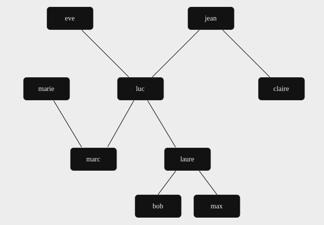

# Family_Relationships.pl

Facts and rules about family relationships.

## Explanation

This Prolog file contains facts and rules related to family relationships. It provides information about individuals within a family, including their gender, parentage, and sibling relationships. The file includes predicates to query and retrieve specific information about family members and their relationships.

### Individual Facts

Individuals are represented by the predicates `is_female/1` and `is_male/1`, indicating their gender.

### Parent-Child Relationships

Parent-child relationships are represented by the `parent/2` predicate, where the first argument is the parent and the second argument is the child.

### Family Tree



### Family Relationships

- `father/2`: Determines the father of a child based on the parent-child relationship and the gender of the parent.
- `mother/2`: Determines the mother of a child based on the parent-child relationship and the gender of the parent.
- `brother/2`: Determines the brother of an individual based on shared parentage and gender.
- `sister/2`: Determines the sister of an individual based on shared parentage and gender.
- `aunt/2`: Determines the aunt of an individual based on the parent's sister.
- `uncle/2`: Determines the uncle of an individual based on the parent's brother.
- `ancestor/2`: Determines if an individual is an ancestor of another individual based on the parent-child relationship.

### Usage

This Prolog file can be consulted and queried to determine various family relationships such as parents, siblings, aunts, uncles, and ancestors.

```prolog
consult(family).
father(Father, Child).
mother(Mother, Child).
brother(Brother, Sibling).
sister(Sister, Sibling).
aunt(Aunt, NieceNephew).
uncle(Uncle, NieceNephew).
ancestor(Ancestor, Descendant).
```